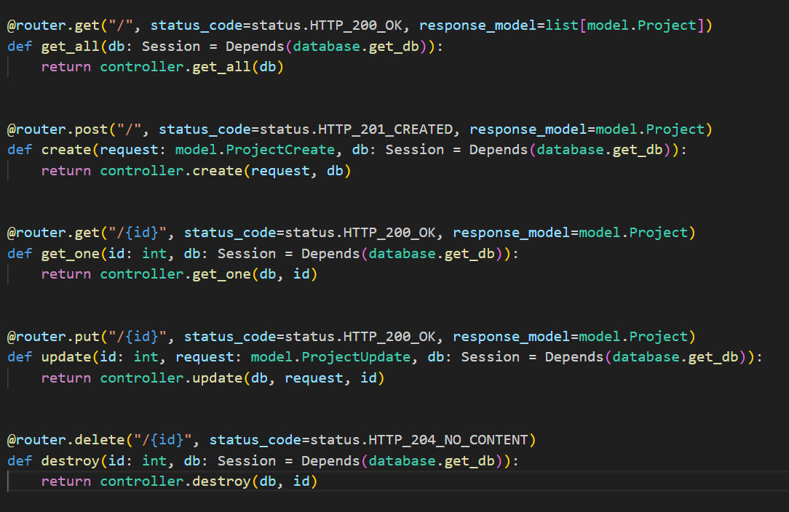

# FastApi_best_practice_pattern

### Best Object-Oriented pattern for FastApi framework with Authentication and error handling  

- Create a Virtual Environment and run `pip install -r requirements.txt` to install the dependencies.
- Create an empty database (default name in the project is `test_db`).
- Change the app/config.py based on your MySql credential.
- Run `uvicorn main:app --reload` in command line.
- Open `http://127.0.0.1:8000/docs` in the browser.

# FastAPI 项目路由模块

本模块包含项目的主要API路由定义，包括用户管理和项目管理功能。

## 🚀 功能特性

- 👥 完整的用户认证系统（登录/注册）
- 🔐 基于JWT的权限控制
- 📦 项目管理CRUD操作
- 🛡️ 路由级权限校验

## 📂 文件结构
router/
├── init.py # 包初始化文件
├── index.py # 路由加载入口
├── projects.py # 项目相关路由
└── users.py # 

## 🛠️ 路由说明

### 用户路由 (/user)
- `GET /user` - 获取所有用户列表 (需认证)
- `POST /user` - 创建新用户
- `GET /user/{id}` - 获取指定用户详情 (需认证)
- `PUT /user/{id}` - 更新用户信息 (需认证)
- `DELETE /user/{id}` - 删除用户 (需认证)
- `POST /user/login` - 用户登录 (获取访问令牌)

### 项目路由 (/project)
- `GET /project` - 获取所有项目列表 (需认证)
- `POST /project` - 创建新项目 (需认证)
- `GET /project/{id}` - 获取指定项目详情 (需认证)
- `PUT /project/{id}` - 更新项目信息 (需认证)
- `DELETE /project/{id}` - 删除项目 (需认证)

## � 开发指南

1. 添加新路由文件时，需在`index.py`中注册
2. 使用`APIRouter`的`dependencies`参数添加路由级中间件
3. 响应模型统一使用`app.models`中定义的模型

